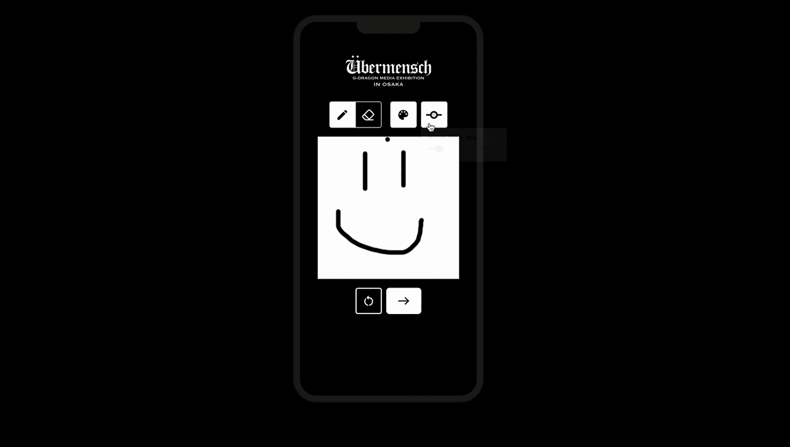

# Message Wall (Demo Version)

An interactive drawing installation where visitors doodle on a phone and watch their
sketch animate onto a shared "message wall" in real time. Built for the **Übermensch:
G-Dragon Media Exhibition in Osaka**, where the wall was projected on-site and every
doodle drawn during the run was collected and shared with the artist after the exhibition
closed.

This repository is the **demo build** — a self-contained, backend-free version that runs
entirely in the browser so the experience can be hosted on GitHub Pages. The original
production system that ran at the exhibition (and persisted drawings) is described under
[Architecture](#architecture).

<p>
  
  
  
  
  
  
  
</p>

**Live demo:** https://starmarb.github.io/message-wall/
  

---

## Contents

- [What it does](#what-it-does)
- [The two builds](#the-two-builds)
- [Architecture](#architecture)
  - [Frontend](#frontend)
  - [Backend (production build)](#backend-production-build)
- [Running locally](#running-locally)
- [Deployment](#deployment)
- [Data & privacy](#data--privacy)
- [Credits](#credits)

---

## What it does

When a drawing is submitted through the phone, it is re-animated and displayed on the larger Message Wall. After submitting their drawings, users have the option to submit more or to save their drawings before moving onto the rest of the exhibition. 

At the exhibition this ran as two coordinated surfaces: personal phones/tablets for visitors to draw
on after scanning the designated QR code, and an LED screen that continuously pulled in and displayed new submissions.

## The two builds

| | **Message Wall** (this repo) | **doodle-display** (production) |
|---|---|---|
| Purpose | Public demo / portfolio | Ran live at the exhibition |
| Topology | Single browser tab, no server | Next.js frontend + Hono/Bun backend |
| Persistence | Ephemeral (tab memory only) | Server-side ring buffer; drawings collected for the artist |
| Wall updates | In-tab, immediate on submit | Backend polling across devices (~1s) |
| Hosting | GitHub Pages (static export) | Render (frontend + backend) |
| Source | `starmarb/message-wall` | `starmarb/doodle-display` |

## Architecture

### Frontend

Shared by both builds.

- **Next.js 15 (App Router)** with **React 19** and **TypeScript**.
- **Drawing surface:** [`react-canvas-draw`](https://www.npmjs.com/package/react-canvas-draw)
  wrapped in a custom editor that adds a draw/erase toggle, color picker, brush-size
  popover, reset, and submit. Strokes are serialized to the library's JSON `saveData`
  format so a drawing is portable, replayable, and cheap to store/transmit.
- **Rendering & replay:** a `canvas` utility re-renders `saveData` onto a `<canvas>` at
  arbitrary sizes and can *animate* it stroke-by-stroke (used for the "draws itself onto
  the wall" effect). A watermark is composited on top for the downloadable PNG export.
- **Wall layout:** each incoming drawing is placed with a randomized position/scale/rotation
  and a collision check against existing pieces so sketches don't overlap; the container is
  measured with a `ResizeObserver` so placement stays correct as the panel resizes.
- **UI:** **MUI 7** (with **Emotion**) for controls and **Tailwind CSS v4** for layout
  utilities. The phone frame, reveal, and slide are pure CSS transitions — the phone starts
  centered, then the wall panel animates from zero to full width, sliding the phone left as
  it grows.
- **Static export:** the demo sets `output: "export"` with a configurable `basePath`, so
  the whole app compiles to static HTML/JS/CSS that GitHub Pages can serve from a subpath.

### Backend (production build)

Lives in `starmarb/doodle-display` under `hono-backend/`.

- **Runtime & framework:** [**Hono**](https://hono.dev/) served on **Bun**, in TypeScript.
- **API:**
  - `POST /submit` — accepts a drawing's serialized canvas, assigns a `crypto.randomUUID()`,
    and stores it.
  - `GET /getAll` — returns the current set of drawings for the wall to render.
- **Storage — bounded in-memory ring buffer:** submissions go into a `CircularArray` built
  on a deque with a fixed capacity (`MAX_IMAGES = 100`). When full, the oldest entry is
  evicted (`popFront`) as a new one is pushed. This keeps memory constant and the wall
  showing the *most recent* N drawings during a busy exhibition, with no database required.
- **Live updates via polling:** rather than sockets, the display uses a `useDrawingPolling`
  hook that fetches `/getAll` on an interval (~1s), tracks already-rendered IDs in a `Set`,
  and only animates in genuinely new drawings — so multiple projected walls or devices stay
  in sync and no drawing renders twice.
- **CORS** is restricted to the known frontend origins; the frontend targets the backend via
  a `NEXT_PUBLIC_BACKEND_BASE_URL` env var (`axios` for submit).

## Running locally

### Demo (this repo)

```bash
cd next-frontend
npm install --legacy-peer-deps   # react-canvas-draw expects React 16/17; project uses 19
npm run dev                      # http://localhost:3000
```

`--legacy-peer-deps` only silences that one peer-dependency warning and is already baked
into CI.

### Production build (doodle-display)

```bash
# Backend
cd hono-backend
bun install
bun run dev                      # serves the API (default :4000)

# Frontend (in another terminal)
cd next-frontend
npm install --legacy-peer-deps
# point the frontend at the backend:
echo 'NEXT_PUBLIC_BACKEND_BASE_URL=http://localhost:4000' > .env.local
npm run dev
```
## Data & privacy

**Demo:** nothing is uploaded or persisted anywhere. Drawings live only in the browser
tab's memory/`sessionStorage`, just long enough to render, and disappear when the tab is
closed or navigated away.

**Exhibition build:** submissions were held in the server's in-memory ring buffer during the
event and the collection of doodles was shared with the artist after the exhibition ended.
No accounts, no personal data, no long-term database.


<!-- Recommended: add a one-line note on YOUR specific contributions here (e.g. which
     features/components/endpoints you built or owned). For a resume, honest, specific
     ownership reads far stronger than an unqualified "I built this." -->
